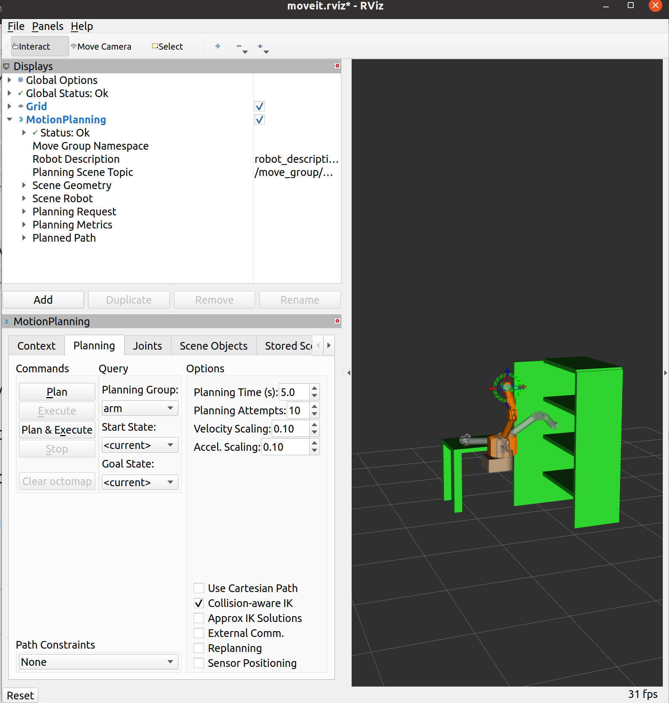

USE MOVEIT TO COLLECT ROBOT TRAJECTORY DATA
--------------------------------------------

**Create an environment for a 7-DOF WAM in a Rviz environment with cluttered obstacles.**



 * Tutorial for Moveit: \
[Moveit step by step tutorial](https://ros-planning.github.io/moveit_tutorials/doc/getting_started/getting_started.html)
 . This project has been tested on Ubuntu20.04 ROS noetic with moveit1.
 * Installation:
   ```
   mkdir -p ~/ws_moveit/src 
   cd ~/ws_moveit/src 
   git clone https://github.com/hzyu17/moveit_wam_ros_noetic.git --recurse-submodules 
   cd ~/ws_moveit && catkin build 
   source ~/ws_moveit/devel/setup.bash 
   ``` 
 * Build:
   ```
   cd ~/ws_moveit && catkin build
   source ~/ws_moveit/devel/setup.bash 
   ```
 * Usage: \
   After creating the neccessary ROS environments and installation of moveit
```
roslaunch barrett_wam_moveit_config demo.launch
```
