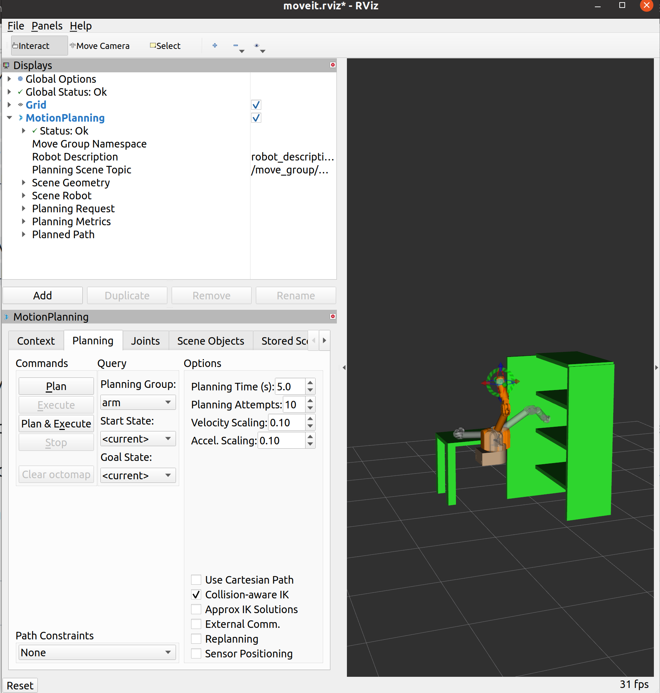

USE MOVEIT TO COLLECT ROBOT TRAJECTORY DATA
--------------------------------------------

**Collect trajectory data from a 7-DOF pandas robot arm in a Rviz environment with cluttered obstacles. Motion planning pipeline is OMPL-CHOMP integrated in moveit.**



 * Tutorial for Moveit: \
[Moveit step by step tutorial](https://ros-planning.github.io/moveit_tutorials/doc/getting_started/getting_started.html)
 . This project has been tested on Ubuntu18.04 ROS melodic with moveit1.
 * Requirements
Ubuntu18.04 \
[ROS melodic](http://wiki.ros.org/melodic/Installation/Ubuntu)
	
 * Installation:\
   <code> mkdir -p ~/ws_moveit/src \
             cd ~/ws_moveit/src \
	     git clone https://github.com/hzyu17/moveit_wam_ros_noetic.git --recurse-submodules \
	     cd ~/ws_moveit && catkin build \
             source ~/ws_moveit/devel/setup.bash \
   </code> 
 * Build:\
   <code> cd ~/ws_moveit && catkin build \ 
	  source ~/ws_moveit/devel/setup.bash \
   </code>
 * Usage: \
   After creating the neccessary ROS environments and installation of moveit
```
roslaunch barrett_wam_moveit_config demo.launch
```
